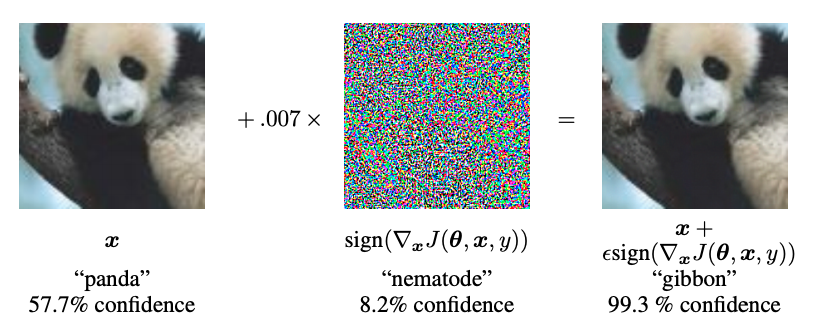
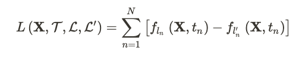
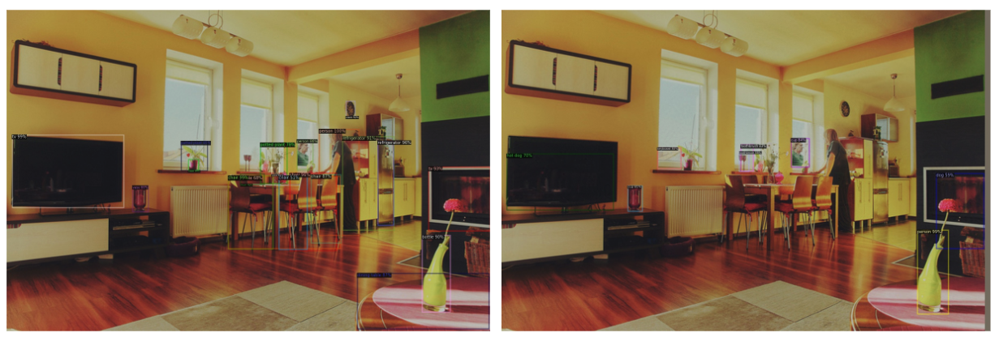
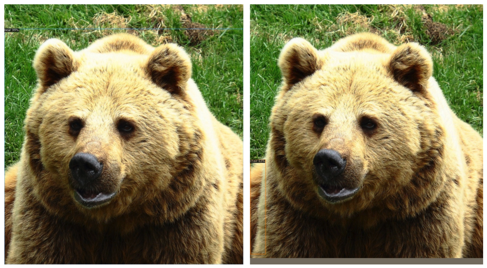
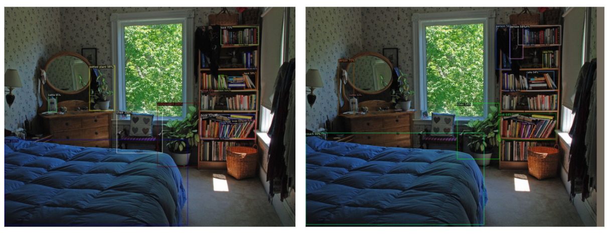
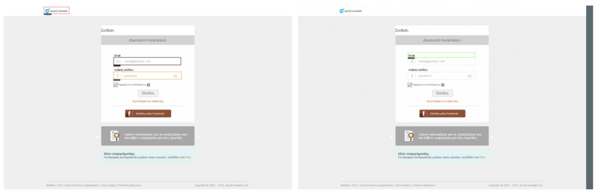
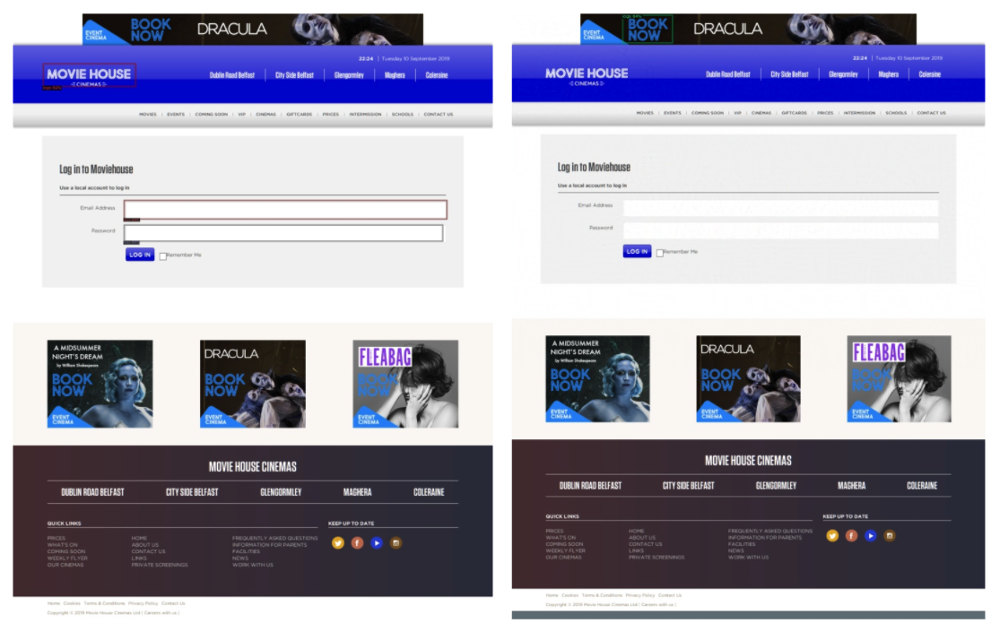

# Adversarial Examples for Object Detection

This repository contains experiments on the generation of Adversarial Examples for Object Detection tasks, in particular for logo and input box detection for phishing website detection applications.

The primary technique used is the Dense Adversary Generation (DAG) algorithm from [Adversarial Examples for Semantic Segmentation and Object Detection (Xie et al., ICCV 2017)](https://arxiv.org/abs/1703.08603), and is implemented on the [Detectron2](https://github.com/facebookresearch/detectron2) framework.

## Introduction
Recent research has exposed the security vulnerabilities of ML models, in particular showing that adding imperceptible perturbations to an image can cause drastically different model performance.

One of the first and most popular adversarial attacks to date is the Fast Gradient Sign Attack (FGSM) described by Goodfellow et al. in [Explaining and Harnessing Adversarial Examples](https://arxiv.org/abs/1412.6572). The idea is to abuse the way neural networks learn, through gradients; rather than tweaking the model's weights to minimize the loss, the attack adjusts the input data/image instead to maximize the loss through backpropagated gradients.

In other words, you take the gradient of the classification loss w.r.t. the input image, and add that to the image. The result is a misclassification.

Xi et al. proposes a natural extension of adversarial attacks on image classification to object detection tasks: instead of tweaking the image to make the model perform badly on a single task, i.e classification, you tweak the image to make the model perform badly on multiple tasks in tandem, i.e. localization and classification of objects of interest in the image.

Hence, it's just a matter of changing the loss function to reflect your adversarial objective.

## Method
The DAG algorithm presented is a **white-box attack**; it assumes the attacker has full knowledge and access to the model, including architecture, inputs, outputs and weights. Furthermore, it can perform **source/target misclassification**; it allows the attacker to specify the target class to misclassify the object as.

DAG maximizes the following objective:

To break it down, for each target (object) on the image, it will:
- Suppress the confidence of the ground-truth class, while
- Increasing the confidence of the adversarial class

In plain english, maximizing this objective will cause every target to be incorrectly predicted as the adversarial label.

However, singling out the targets on the image to attack (which regions to misclassify) is non-trivial task, and the authors propose utilizing the region proposals from the Region Proposal Network (RPN) of the object detection model as a starting point. In addition, they suggest increasing the Non-maximum Suppression (NMS) threshold of the RPN to 0.9, allowing for a larger or **denser** set of targets to be proposed (hence the name of the algorithm).

As follows is a sketch of the complete DAG algorithm:
1. Acquire target proposals from the RPN (with NMS threshold of 0.9)
2. Filter for targets that actually overlap with the ground-truth object, and with a confidence score for the ground-truth class > 0.1 (i.e. narrow down to a robust set of targets to attack).
3. Randomly assign an adversarial label to each target
4. Then for N iterations (N = 150 suggested by the authors):
    1. Compute the objective, only using targets still not misclassified as the adversarial label
    2. Take the normalized gradient of the objective and add it to the image
    3. Terminate if all targets are misclassified as desired, else repeat

## Results
All experiments are performed using [Detectron2's implementation](https://github.com/facebookresearch/detectron2/blob/master/MODEL_ZOO.md) of Faster R-CNN, with ResNet50 backbone and Feature Pyramid Network.

Evaluation is performed on a hold-set test set (disjoint from the training set).

In all cases, the adversarial attack manages to break the model and reduces all the metrics reported drastically.

### COCO Dataset
|                     | Original | Adversarial |
|---------------------|----------|-------------|
| mAP (IoU=0.50:0.95) | 40.2     | 0.0         |

Some qualitative results, with original prediction on the left, and prediction on adversarial image on the right.

### Phishing Dataset
|                          | Original | Adversarial |
|--------------------------|----------|-------------|
| mAP (IoU=0.50:0.95)      | 59.7     | 2.9         |
|                          |          |             |
| Input AP (IoU=0.50:0.95) | 70.0     | 0.8         |
| Input Recall (IoU=0.50)  | 98.1     | 20.8        |
| Input Recall (IoU=0.70)  | 95.3     | 3.4         |
| Input Recall (IoU=0.85)  | 74.9     | 0.1         |
|                          |          |             |
| Logo AP (IoU=0.50:0.95)  | 49.3     | 5.0         |
| Logo Recall (IoU=0.50)   | 94.1     | 28.7        |
| Logo Recall (IoU=0.70)   | 80.9     | 15.9        |
| Logo Recall (IoU=0.85)   | 38.0     | 3.5         |

Some qualitative results, with original prediction on the left, and prediction on adversarial image on the right.

## Future Work
### Computational Efficiency
While effective, the algorithm requires up to ~150 iterations on every single image. While this allows us to trade computational efficiency for severity of attack, a more efficient algorithm can still be explored.

### More fine-grained control over prediction target
Similar to adversarial attacks for image classification tasks, the DAG algorithm allows the attacker to specify which target class to misclassify as. However in object detection, in addition to classification, it also has a bounding box regression output. An interesting direction to explore would be to allow the attacker to control where these bounding boxes land.

### Defense
Techniques such as adversarial training are well-proven defenses against adversarial attacks in the image classification setting. Whether these approaches transfer over to object detection, or development of a more specialized defense is required is worth delving into.

## Resources
### Adversarial Machine Learning
Here is a good [Reading List (Nicholas Carlini)](https://nicholas.carlini.com/writing/2018/adversarial-machine-learning-reading-list.html) as a starting point to get acquainted with the foundations of adversarial machine learning.

### Object Detection with Deep Learning
If you'll like to refresh your knowledge of deep learning for computer vision and its advanced applications, I recommend [this course](https://web.eecs.umich.edu/~justincj/teaching/eecs498/) by the University of Michigan. It's fairly up-to-date (Fall 2019) and the lecture videos are publicly available.

### Detectron2
When working with object detection applications, it behoves to be familiar with the COCO dataset format, as it is a common entry point for most frameworks and APIs. I will recommend this tutorial: [Create COCO Annotations From Scratch](https://www.immersivelimit.com/tutorials/create-coco-annotations-from-scratch).

The Detectron2 library can be a bit tricky to get used to, with a lack of community tutorials and a more research-oriented API design. Much of understanding how to tweak the models unfortunately requires a bit of digging into the Detectron2 source code.

That said, you can start with the [Official Detectron2 Documentation](https://detectron2.readthedocs.io/index.html), and this set of tutorials by Hiroto Honda: [Digging into Detectron2](https://medium.com/@hirotoschwert/digging-into-detectron-2-47b2e794fabd).

## References
1. [Xie et al., 2017] Cihang Xie, Jianyu Wang, Zhishuai Zhang, Yuyin
Zhou, Lingxi Xie, and Alan Yuille. Adversarial examples for semantic segmentation and object detection. In ICCV. IEEE, 2017.
2. Official DAG algorithm implementation: https://github.com/cihangxie/DAG
3. DAG algorithm implementation in PyTorch: https://github.com/IFL-CAMP/dense_adversarial_generation_pytorch